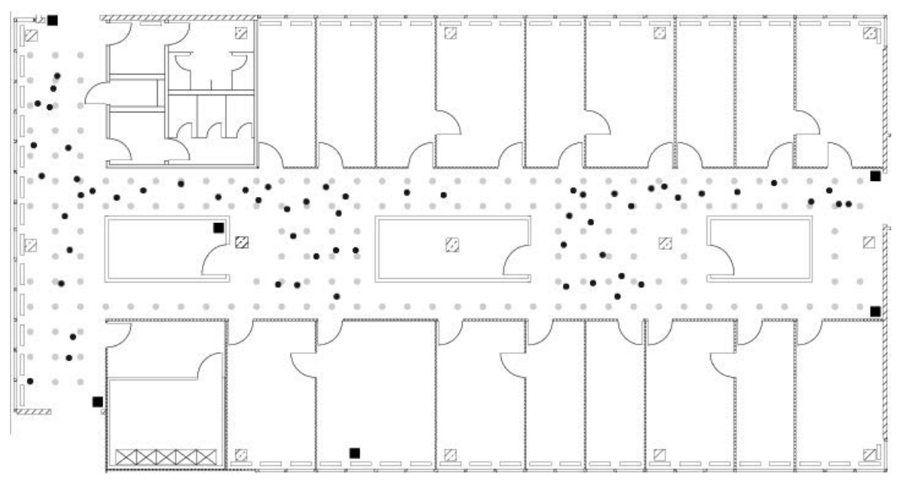

```{r setup, include=FALSE}
library(knitr)
```
## Abstract
As the technology improves and newer devices have developed, wireless devices have become one of the most important tools in our life. This case study was undertaken in order to highlight and address the use of real-time location system (RTLS) technology and WiFi signals to predict the location of a devices indoor. Indoor Positioning Systems(IPS) is a solution to locate people inside a building by using signal strength. 

For this case study we are using a dataset provide in chapter 1 of the book Data Science in R by Nolan and Lang. The dataset contains data from WiFi devices on a floor of a building at the University of Mannheim. We will build a model to examine the signals strength within a building and then predict location of these devices.  Location prediction is achieved by application of the k-nearest neighbors (kNN) clustering technique to a real location data set. Both a weighted and unweighted kNN are used and performance of the two classification methods on the data is then evaluated and compared against simple average predictions to determine the best prediction method.

## Literature Review
The growth of wireless networking has generated commercial and research interests in statistical
methods to reliably track people and things inside stores, hospitals, warehouses, and factories.
With the proliferation of wireless local area networks (LANs), indoor positioning systems (IPS)
can utilize WiFi signals detected from network access points to answer questions such as: where is
a piece of equipment in a hospital? where am I? and who are my neighbors?

Real-time location systems (RTLS) are local systems comprised of tags, readers, and location sensing systems that function as a whole to accurately determine locations of people or objects in real-time. While GPS has become a ubiquitous solution for outdoor real-time locating, RTLS technology has evolved and become much more prevalent for indoor tracking.

To build an indoor positioning system requires a reference set of data where the signal strength
between a hand-held device such as a cellular phone or laptop and fixed access points (routers) are
measured at known locations throughout the building. With these training data, we can build a
model for the location of a device as a function of the strength of the signals between the device
and each access point. Then we use this model to predict the location of a new unknown device
based on the detected signals for the device. In this project, we will examine nearly one million
measurements of signal strength recorded at 6 stationary WiFi access points (routers) within a
building at the University of Mannheim and develop a statistical IPS.

## Introduction
The low cost and near ubiquity of wireless networking infrastructure in buildings has brought with it a long desired side benefit, the ability to track people and equipment moving through a space in near real-time. The goal of knowing who and what are in a location and the ability to track their movements has many applications for which solutions have long been sought. In grocery stores, for instance, significant resources were commonly used to study the paths shoppers took from the time they arrived until they left. Data could be used to plan the layout of goods, to sell shelf space at a premium, and to assist in dedicating loss prevention resources. These efforts were costly and nowhere near real-time, and did not easily account for future layout changes.

In this case study we use the R language to process raw data collected from an existing wireless infrastructure and develop an analytical engine to create an indoor positioning system (IPS) to achieve this location awareness. The data set used is comprised of MAC addresses from recorded connections made to routers within the college dormitory. WiFi signal strength is measured at every router (network access point) via a mobile scanning device, and by measuring signal strength for these routers at various locations we are able to create a reference dataset on which to base device position predictions.

The data used in the case study consists of two datasets that are named ‘offline’ and ‘online’. ‘Offline’ data is used for training the models and is collected from of 166 points spaced 1 meter apart in the hallway of the floor plan (grey circles in image above.) The ‘online’ data is for testing and predicting and are collected from 60 location from the same floor (black circles in figure 1 below.)



In this case study we will be using a statistical method known as the k-nearest neighbor to estimate the location of a device from the strength of the signal detected between the device and several access points. Our dataset contains training data where the signal is measured to several access points from known positions throughout the building. When we get new observations from an unknown location, we find the observation from our training data that is closest to this new observation. This method allows us to predict the position of the new observation.

#### Description of Data
Each observation in the raw data collected from the hand-held measuring device is recorded on a single line with values separated by semicolons. The first data line in the offline set is given as an example below, broken up for better legibility. The online dataset follows the same format.

| t=1139643118358;id=00:02:2D:21:0F:33;pos=0.0,0.0,0.0;degree=0.0;
| 00:14:bf:b1:97:8a=-38,2437000000,3;
| 00:14:bf:b1:97:90=-56,2427000000,3;
| 00:0f:a3:39:e1:c0=-53,2462000000,3;
| 00:14:bf:b1:97:8d=-65,2442000000,3;
| 00:14:bf:b1:97:81=-65,2422000000,3;
| 00:14:bf:3b:c7:c6=-66,2432000000,3;
| 00:0f:a3:39:dd:cd=-75,2412000000,3;
| 00:0f:a3:39:e0:4b=-78,2462000000,3;
| 00:0f:a3:39:e2:10=-87,2437000000,3;
| 02:64:fb:68:52:e6=-88,2447000000,1;
| 02:00:42:55:31:00=-84,2457000000,1

The available documentation indicates that the format of the data is:

* t="Timestamp"; 
* id="MACofScanDevice"; 
* pos="RealPosition";
* degree="orientation";
* MACofResponse1="SignalStrengthValue,Frequency,Mode";
* MACofResponseN="SignalStrengthValue,Frequency,Mode"

The units of the measurements are described below:

* t: Timestamp in milliseconds since midnight, January 1, 1970 UTC
* id: MAC address of the scanning device
* pos: The physical coordinate of the scanning device
* degree: Orientation of the user carrying the scanning device in degrees MAC
* MAC: Address of a responding peer (e.g., an access point or a device in adhoc mode) with the corresponding values for signal strength in dBm (Decibel-milliwatts),the channel frequency and its mode (access point = 3, device in adhoc mode = 1)

## Methods
The steps we will use in this case study are as below

1. Data downloads.
2. Raw data preprocessing, cleanup and exploratory data analysis.
3. Signal strength analysis.
4. Implementation of kNN.
5. Comparison of kNN approaches to determine the best location prediction method.


## Results

#### Download files from the remote url's
For this case study we will use a dataset created by the University of Mannheim. The offline dataset is an open-source dataset that can be found online at http://rdatasciencecases.org/Data/offline.final.trace.txt. This offline dataset will be used as the training dataset to build our prediction model.  The test dataset, or online data, is comprised of 60 randomly selected locations throughout the floor, but is otherwise similar to the offline data and prepared for analysis in the same way it, can be found online at http://rdatasciencecases.org/Data/online.final.trace.txt .

```{r}
#urls for downloading
# OFFLINEURL <- "http://rdatasciencecases.org/Data/offline.final.trace.txt"
# ONLINEURL <- "http://rdatasciencecases.org/Data/online.final.trace.txt"
# 
# #create a temporary name for temporary file
# OfflineFile <- "../Data/offline.final.trace.txt"
# OnlineFile <- "../Data/online.final.trace.txt"
# 
# 
# #download the data and store in temp file
# if(!file.exists(OfflineFile)){
#   download.file(OFFLINEURL, OfflineFile, method="auto")
# }
# if(!file.exists(OnlineFile)){
#   download.file(ONLINEURL, OnlineFile, method="auto")
# }
```

#### Raw Data Preprocessing, cleanup and exploratory data analysis
Before we are able to analyze this signal data using k-Nearest Neighbors, we must first clean and explore the data. We will start by reading the data file into a variable named data.

```{r}
#data = readLines("../Data/offline.final.trace.txt")
```
next we look at the number of files in the file that start with '#' character which are comments
```{r}
#sum(substr(data, 1, 1) == "#")
```
The total number of lines in the file can be found using the length command
```{r}
#length(data)
```
Subtracting 5312 (the number of lines starting with a ‘#’ character - i.e. comments) from 151,392 (the number of total lines in the file) gives us 146,080 non-comment lines
Next we need to split the data in to a readable format for further analysis
```{r}
# strsplit(data[4], ";")[[1]]
```
Look at the output of the resulting string we, can split futher using an equal sign delimiter and value of some of POS fields can be seperated by commas. A more easier way to do a split woudl be as below.
```{r}
#tokens = strsplit(data[4], "[;=,]")[[1]]
#tokens[1:10]
```
The first four variables (timestamp, MAC address, position (x, y, and z), and orientation) can be extracted out from the data as follows.
```{r}
#tokens[c(2, 4, 6:8, 10)]
```
Below we look at the readings for all of the responding devices by stripping out the first 10 elements of the array.
```{r}
#tokens[ - (1:10)]
```
In order to build out the additional columns for our data to only include one location per line, we will need to bind each of these sets of 4 values from the responding devices with the initial 4 values in the line.
```{r}
#tmp = matrix(tokens[ - (1:10) ], ncol = 4, byrow = TRUE)
#mat = cbind(matrix(tokens[c(2, 4, 6:8, 10)], nrow = nrow(tmp), ncol = 6, byrow = TRUE), tmp)
```
This produces a matrix containing 11 columns that each have 10 rows. As we can verify below using the dim command.
```{r}
#dim(mat)
```
All of the above steps can now be organised together in to a single function as below.
```{r}
# processLine = function(x)
#   {
#     tokens = strsplit(x, "[;=,]")[[1]]
#     if (length(tokens) == 10)
#       return(NULL)
# 
#     tmp = matrix(tokens[ - (1:10)], ncol = 4, byrow = TRUE)
#     cbind(matrix(tokens[c(2, 4, 6:8, 10)], nrow = nrow(tmp),ncol = 6, byrow = TRUE), tmp)
#   }
```
Applying the above cleanup function to the whole data file below
```{r}
# lines = data[ substr(data, 1, 1) != "#" ]
# tmp = lapply(lines, processLine)
# offline = as.data.frame(do.call("rbind", tmp),
#                         stringsAsFactors = FALSE)
# dim(offline)
```
Assigning columns names so as to make its easiar to interpret the data.
```{r}
# names(offline) = c("time", "scanMac", "posX", "posY", "posZ", "orientation", "mac", "signal", "channel", "type")
```
pos(x,y,z), signal, orientation and time can be converted to numeric.
```{r}
# numVars = c("time", "posX", "posY", "posZ",
#             "orientation", "signal")
# offline[ numVars ] = lapply(offline[ numVars ], as.numeric)
```
The type variable signifies 1 as adhoc devices and 3 for access points. Since this analysis is only related to access points we can exclude any data that is not related.And then we can also drop the type column.
```{r}
# offline = offline[ offline$type == "3", ]
# offline = offline[ , "type" != names(offline) ]
# dim(offline)
```
The resulting dataset now contains 978,443 records and only 9 columns instead of the original 10.
Next, we will convert the time column to a datetime format. This column currently contains the number of milliseconds from the UNIX epoch. Since the POSIXt format uses the number of seconds from the epoch instead of milliseconds, the data will need to be scaled. We will also keep the original time format in a new column named rawTime. 
```{r}
# offline$rawTime = offline$time
# offline$time = offline$time/1000
# class(offline$time) = c("POSIXt", "POSIXct")
```
Summary of the data now looks as below.
```{r}
# summary(offline[, numVars])
```
The scanMac column has the same value for all the rows. Also the posZ is always 0. We can safely drop those and they dont add any value to the analysis.
```{r}
# offline = offline[ , !(names(offline) %in% c("scanMac", "posZ"))]
```
Next, looking at orientation field and plotting the values as below.
```{r}
# plot(ecdf(offline$orientation))
```
We can see from the plot that the orientations are all clustered around the 8 expected values (0, 45, 90, 135, 180, 225, 270, 315). Since we would like to analyze the 8 defined orientations and the actual values are close, we can convert the actual values to their closest desired value
```{r}
# roundOrientation = function(angles) {
#   refs = seq(0, by = 45, length = 9)
#   q = sapply(angles, function(o) which.min(abs(o - refs)))
#   c(refs[1:8], 0)[q]
# }
# offline$angle = roundOrientation(offline$orientation)
```
Plotting the new angles below.
```{r}
# with(offline, boxplot(orientation ~ angle,
#                       xlab = "nearest 45 degree angle",
#                       ylab = "orientation"))
```
Next, we want to look at variable mac and channel variables.First, we will count the number of unique MAC addresses and unique channels.
```{r}
# c(length(unique(offline$mac)), length(unique(offline$channel)))
# table(offline$mac)
```
The original text file contains data for 12 access points. We used exploratory data analysis to determine which of these were the six access points on the correct floor of the Mannheim University building. We were looking for 5 Cisco access points and one Lancom access point. We determined the five Cisco access points by identifying the mac addresses starting with 00:14:bf. We took the other two potential mac addresses and observed their associated signal strengths. Below are their graphs. We determined that the access point with stronger signal strength was the correct accesspoint. We inferred that the other potential access point resided on a different floor of the building.
```{r}
subMacs = c('00:0f:a3:39:e1:c0', '00:14:bf:b1:97:90', '00:14:bf:3b:c7:c6',
             '00:14:bf:b1:97:81', '00:14:bf:b1:97:8a', '00:14:bf:b1:97:8d')
```
Next, we want to explore the x,y variables. The code below computes the total possible number of combinations for X and Y (476), checks if the values are null (310), and finally outputs non-null values (166). Knowing there are 166 positions where data was recorded, we can calculate the number of data points collected at each position. The matrix below shows the exact counts.
```{r}
# locDF = with(offline, 
#              by(offline, list(posX, posY), function(x) x))
# len.locDF = length(locDF)
# sum.locDF.null = sum(sapply(locDF, is.null))
# locDF = locDF[ !sapply(locDF, is.null) ]
# len.locDF.nonull = length(locDF)
# locCounts = sapply(locDF, nrow)
# locCounts = sapply(locDF, 
#                    function(df) 
#                      c(df[1, c("posX", "posY")], count = nrow(df)))
# dim(locCounts)
# locCounts[ , 1:8]
```
All the above steps read, structure, explore, and clean data from an external source are grouped together into a single function and the same function can be used for both offline and online data sets. Below we use the function readData() to perform all the steps above. 
With the preprocessing complete, we store each dataframe as an RDS object for faster access and smaller file size and continue to explore the data and develop our IPS.
```{r}
# Make data
# processLine = function(x)
# {
#   tokens = strsplit(x, "[;=,]")[[1]]
#   
#   if (length(tokens) == 10) 
#     return(NULL)
#   
#   tmp = matrix(tokens[ - (1:10) ], ncol= 4, byrow = TRUE)
#   cbind(matrix(tokens[c(2, 4, 6:8, 10)], nrow(tmp), 6, 
#                byrow = TRUE), tmp)
# }
# 
roundOrientation = function(angles) {
  refs = seq(0, by = 45, length  = 9)
  q = sapply(angles, function(o) which.min(abs(o - refs)))
  c(refs[1:8], 0)[q]
}
# 
# readData = 
#   function(filename, subMacs )
#   {
#     txt = readLines(filename)
#     lines = txt[ substr(txt, 1, 1) != "#" ]
#     tmp = lapply(lines, processLine)
#     offline = as.data.frame(do.call("rbind", tmp), 
#                             stringsAsFactors= FALSE) 
#     
#     names(offline) = c("time", "scanMac", 
#                        "posX", "posY", "posZ", "orientation", 
#                        "mac", "signal", "channel", "type")
#     
#     # keep only signals from access points
#     offline = offline[ offline$type == "3", ]
#     
#     # drop scanMac, posZ, channel, and type - no info in them
#     dropVars = c("scanMac", "posZ", "channel", "type")
#     offline = offline[ , !( names(offline) %in% dropVars ) ]
#     
#     # drop more unwanted access points
#     offline = offline[ offline$mac %in% subMacs, ]
#     
#     # convert numeric values
#     numVars = c("time", "posX", "posY", "orientation", "signal")
#     offline[ numVars ] = lapply(offline[ numVars ], as.numeric)
#     
#     # convert time to POSIX
#     offline$rawTime = offline$time
#     offline$time = offline$time/1000
#     class(offline$time) = c("POSIXt", "POSIXct")
#     
#     # round orientations to nearest 45
#     offline$angle = roundOrientation(offline$orientation)
#     
#     return(offline)
#   }
# 
# ################ Offline Data ##################
# 
# offline <- readData(filename = "../Data/offline.final.trace.txt" , subMacs=subMacs)
# 
# offline$posXY = paste(offline$posX, offline$posY, sep = "-")
# 
# # Saving as a R binary file has faster i/o then csv and smaller size.
# saveRDS(offline, file="../Data/processed/offline.rds") 
# ################ Online Data ##################
# online <- readData(filename = "../Data/online.final.trace.txt", subMacs=subMacs)
# online$posXY = paste(online$posX, online$posY, sep = "-")
# 
# # Save data
# saveRDS(online, file="../Data/processed/online.rds")
# ################ Online Data - All MACs ###############
# online_allmacs <- readData(filename = "../Data/online.final.trace.txt", subMacs=subMacs)
# 
# online_allmacs$posXY = paste(online$posX, online$posY, sep = "-")
# 
# # Save data
# saveRDS(online_allmacs, file="../Data/processed/online_allmacs.rds")
```


```{r}
offline <- readRDS("../Data/processed/offline.rds")
online <- readRDS("../Data/processed/online_allmacs.rds")
online_allmacs <- readRDS("../Data/processed/online_allmacs.rds")
```

#### Signal Strength Analysis
Using the above cleaned data, we want to explore the relationship between signal strength and distance from observation to access point. We want to answer question like; Is the signal strength 
consistent across distances? Is it significantly impacted by the other variables we collected?

The boxplot below which shows the variance of the signal strength with multiple combinations of position and orientation. We also output a density plot to observe the variance of these combinations and as expected, there is a mixture of normal and skewed distributions.

The boxplots in this figure represent signals for one location, which is in the uper left corner of the floor plan, i.e., x = 2 and y = 12. These boxes are organized by access point and the angle of the hand-held device. The dependence of signal strength on angle is evident at serveral of the access points, e.g., 00:14:bf:97:90 in the top right panel of the figure.
```{r}
library(lattice)
bwplot(signal ~ factor(angle) | mac, data = offline,
       subset = posX == 2 & posY == 12,
       layout = c(2,3))

```

The density curves shown here are density plots for signal strength which represent each of the access point x,y angle combinations. We wanted to see the impact of orientation on signal strength at various points on the map with all the routers involved. We initially didn’t think that orientation would play a major role, but further analysis proved otherwise.
```{r}
macs = unique(offline$mac)
orientations = unique(offline$angle)
  library("RColorBrewer")
  colors = brewer.pal(name = "Blues", n = 9)
  par(mfrow = c(2, 3))
  for (i in 1:6) {
    routerData = offline[offline$mac == macs[i],]
    X = 23
    Y = 7
    
    positionData = routerData[routerData$posX == X & routerData$posY == Y,]
    first = TRUE
    for (k in 1:8) {
      signalAtOrientation = positionData[positionData$angle == orientations[k], c("signal")]
      if (length(signalAtOrientation) <= 2) {
        next
      }
      if (first) {
        plot(density(signalAtOrientation), ylim = c(0, 0.6), xlim = c(-90, -30), 
             col = colors[k], main = paste("(", X, ", ", Y, "): ", macs[i], sep = ""),
             xlab = "Signal Strength (dB)")
        first = FALSE
      }
      else {
        lines(density(signalAtOrientation), col = colors[k])
      }
    }
    lines(density(positionData[,c("signal")]), col = "red")
  }
  legend(legend = c(orientations, "Combined"), x = -90, y = 0.5, col = c(colors, "red"), lty = c(1, 1), lwd = c(2.5, 2.5))
```

This plot shows the density curves for various orientations at the point (23, 7) near the center of the map for all 6 routers. We can clearly see that changing orientation can make up to a 10dB difference or so in the peaks of the density curves. This means that our distance formula would have to take into account, not only signal strength differences, but also orientation differences.

Next, we want take a closer look at summary statistics broken down by each router location. First, we will create couple new variable that contains all combinations of the x and y coordinates of the scanning device and another variable that contains every combination of posXY, angle, and access point MAC address. Then we calcultate summary statistics for each of those.
```{r}
offline$posXY = paste(offline$posX, offline$posY, sep = "-")
byLocAngleAP = with(offline,
                    by(offline, list(posXY, angle, mac),
                       function(x) x))

signalSummary = 
  lapply(byLocAngleAP, 
         function(oneLoc) { 
           ans = oneLoc[1,] 
           ans$medSignal = median(oneLoc$signal) 
           ans$avgSignal = mean(oneLoc$signal) 
           ans$num = length(oneLoc$signal)
           ans$sdSignal = sd(oneLoc$signal)
           ans$iqrSignal = IQR(oneLoc$signal)
           ans
         })
offlineSummary = do.call("rbind", signalSummary)
```

We want to look at a box plot which compares how standard deviation of signal strength varies with mean signal strength for each location/angle/access point combination.
```{r}

## Box plots for mean signal strength
breaks = seq(-90, -30, by = 5)
bwplot(sdSignal ~ cut(avgSignal, breaks = breaks),
       data = offlineSummary,
       xlab = "Mean Signal", ylab = "SD Signal")
```

A closer look at the variance between signal strength and position show something interesting, which is that strong signals have a higher variance while weaker signals have a lower variance.

## k-Nearest Neighbors Analysis
We will now use k-Nearest Neighbors (k-NN) to determine location from access point signal strength. k-NN works by measuring the distance between a new point and it’s neighboring points. The k closest neighboring points to the newest point are used to vote on the value for the new point.

First step we are going to do is to prepare test data. The Online Data has duplicate observations given the time, position, mac, and angle. Similar to the training data set above, the signal strengths will need to be averaged for situations where these tuples of data occur, resulting in a single series of signal data for a given position, mac address and angle.
```{r}
summary(online)
tabonlineXYA = table(online$posXY, online$angle)
tabonlineXYA[1:6, ]
```

It appears that signal strengths were only recorded at one angle for each test location in this data. To account for this, we will reorganize the data to contain a column for each access point containing the average signal strength. This step will make it easier to compute distance between the 6 signal strength vectors. In so doing, we provide the average signal strength at each location as summary.Notice 11 columns are present in our summary, including the concatinated X-Y values, X and Y values in their separate columns, orientation, angle, and the 6 access points’ 
```{r}
keepVars = c("posXY", "posX","posY", "orientation", "angle") 
byLoc = with(online, 
             by(online, list(posXY), 
                function(x) { 
                  ans = x[1, keepVars] 
                  avgSS = tapply(x$signal, x$mac, mean) 
                  y = matrix(avgSS, nrow = 1, ncol = 6, 
                             dimnames = list(ans$posXY, names(avgSS))) 
                  cbind(ans, y) 
                  }))
onlineSummary = do.call("rbind", byLoc)
head(onlineSummary)
```

We discovered in our analysis efforts that orientation does effect signal strength our objective is to find offline data points that share similar orientations to our new location points. Since all observations were recorded in 45 degree increments, this becomes as easy as specifying the number of neighboring angles to include from the offline dataset. For even numbers, this means selecting even multiples of 45 degrees on each side of a test observation’s orientation angle. For odd numbers, it means selecting offline data with angles which match the new observation’s rounded orientation as well as those that flank the new observation’s angle. In the case where only one orientation is desired, offline data with angles matching the new observation’s will be selected only. Below we write a function that creates data structure aggregating the values from these angles.
```{r}
AP = matrix( c( 7.5, 6.3, 2.5, -.8, 12.8, -2.8,  
                1, 14, 33.5, 9.3,  33.5, 2.8),
            ncol = 2, byrow = TRUE,
            dimnames = list(subMacs, c("x", "y") ))
reshapeSS = function(data, varSignal = "signal", 
                     keepVars = c("posXY", "posX","posY")) {
  byLocation =
    with(data, by(data, list(posXY), 
                  function(x) {
                    ans = x[1, keepVars]
                    avgSS = tapply(x[ , varSignal ], x$mac, mean)
                    y = matrix(avgSS, nrow = 1, ncol = 6,
                               dimnames = list(ans$posXY,
                                               names(avgSS)))
                    cbind(ans, y)
                  }))
  newDataSS = do.call("rbind", byLocation)
  return(newDataSS)
}
selectTrain = function(angleNewObs, signals = NULL, m = 1){
  # m is the number of angles to keep between 1 and 5
  refs = seq(0, by = 45, length  = 8)
  nearestAngle = roundOrientation(angleNewObs)
  
  if (m %% 2 == 1) 
    angles = seq(-45 * (m - 1) /2, 45 * (m - 1) /2, length = m)
  else {
    m = m + 1
    angles = seq(-45 * (m - 1) /2, 45 * (m - 1) /2, length = m)
    if (sign(angleNewObs - nearestAngle) > -1) 
      angles = angles[ -1 ]
    else 
      angles = angles[ -m ]
  }
  angles = angles + nearestAngle
  angles[angles < 0] = angles[ angles < 0 ] + 360
  angles[angles > 360] = angles[ angles > 360 ] - 360
  angles = sort(angles)
  
  offlineSubset = signals[ signals$angle %in% angles, ]
  reshapeSS(offlineSubset, varSignal = "avgSignal")
}
```

Next, we want to create a function that will find the nearest neighbor to a given point. We name this function as findNN.
```{r}
findNN = function(newSignal, trainSubset) { 
  diffs = apply(trainSubset[, 4:9], 1, 
                function(x) x - newSignal) 
  dists = apply(diffs, 2, function(x) sqrt(sum(x^2))) 
  closest = order(dists) 
  return(trainSubset[closest, 1:3]) 
}
```

We can now use the selectTrain() and findNN() functions and embed into a wrapper function predXY() wrapper function as below which will use kNN to predict location. 

```{r}
predXY = function(newSignals, newAngles, trainData,
                  numAngles = 1, k = 3){
  closeXY = list(length = nrow(newSignals))
  
  for (i in 1:nrow(newSignals)) {
    trainSS = selectTrain(newAngles[i], trainData, m = numAngles)
    closeXY[[i]] = findNN(newSignal = as.numeric(newSignals[i, ]), trainSS)
  }
  
  estXY = lapply(closeXY,
                 function(x) sapply(x[ ,2:3],
                                    function(x) mean(x[1:k])))
  estXY = do.call("rbind", estXY)
  return(estXY)
}
```
We can test this function using 3 angles anf both k=3 nearest neighbors and k=11 nearest neighbor. Furthermore, model fit is assessed by mapping actual and predicted locations with lines connecting the two points for each respective new observation. This map is first drawn for the 3-NN predictions below.

```{r}
estXYk3 = predXY(newSignals = onlineSummary[ , 6:11], 
                 newAngles = onlineSummary[ , 4], 
                 offlineSummary, numAngles = 3, k = 3)
estXYk1 = predXY(newSignals = onlineSummary[ , 6:11], 
                 newAngles = onlineSummary[ , 4], 
                 offlineSummary, numAngles = 3, k = 1)
floorErrorMap = function(estXY, actualXY, trainPoints = NULL, AP = NULL){
  
    plot(0, 0, xlim = c(0, 35), ylim = c(-3, 15), type = "n",
         xlab = "", ylab = "", axes = FALSE)
    box()
    if ( !is.null(AP) ) points(AP, pch = 15)
    if ( !is.null(trainPoints) )
      points(trainPoints, pch = 19, col="grey", cex = 0.6)
    
    points(x = actualXY[, 1], y = actualXY[, 2], 
           pch = 19, cex = 0.8 )
    points(x = estXY[, 1], y = estXY[, 2], 
           pch = 8, cex = 0.8 )
    segments(x0 = estXY[, 1], y0 = estXY[, 2],
             x1 = actualXY[, 1], y1 = actualXY[ , 2],
             lwd = 2, col = "red")
}
trainPoints = offlineSummary[ offlineSummary$angle == 0 & 
                              offlineSummary$mac == "00:0f:a3:39:e1:c0" ,
                        c("posX", "posY")]
oldPar = par(mar = c(1, 1, 1, 1))

floorErrorMap(estXYk3, onlineSummary[ , c("posX","posY")], 
              trainPoints = trainPoints, AP = AP)
```
Furthermore, model fit is assessed by mapping actual and predicted locations with lines connecting the two points for each respective new observation. This map is first drawn for the 3-NN predictions below.

```{r}
floorErrorMap(estXYk1, onlineSummary[ , c("posX","posY")], 
              trainPoints = trainPoints, AP = AP)
```
Now we can caluclate the error for each of these test sets and compare them to see if using 1 or 3 neighbors produced more accurate results.

```{r}
calcError =
  function(estXY, actualXY)
    sum(rowSums((estXY - actualXY)^2))
actualXY = onlineSummary[ , c("posX", "posY")]
sapply(list(estXYk1, estXYk3), calcError, actualXY)
```
We see that k=3 nearest neighbors produces a lower error rate than using k=1 nearest neighbor.
In order to determine the optimal value for k and avoid overfitting, we will use v-fold cross validation. A v value of 11 is selected since we have 166 different offline locations, allocating 15 locations to each fold.
```{r}
v = 11
permuteLocs = sample(unique(offlineSummary$posXY))
permuteLocs = matrix(permuteLocs, ncol = v, 
                     nrow = floor(length(permuteLocs)/v))
```
```{r}
onlineFold = subset(offlineSummary, posXY %in% permuteLocs[ , 1])
head(onlineFold)
onlineFold.ul <- nrow(unique(onlineFold[,2:3]))
```

Previously we structured and summarized the offline data into 6 signal strength columns, one for each access point, we will do the same with our cross-validated test data. However, because it is easier to structure the test data in its complete form from offline data which is then divided into our desired folds, we now need to modify the reshapeSS() function as follows.
```{r}
seed = 101
reshapeSS = function(data, varSignal = "signal", 
                     keepVars = c("posXY", "posX","posY"),
                     sampleAngle = FALSE, 
                     refs = seq(0, 315, by = 45)) {
    
  set.seed(seed = seed)
    
  byLocation =
    with(data, by(data, list(posXY), 
                  function(x) {
                    if (sampleAngle) { # conditional statement added for cross-validation
                      x = x[x$angle == sample(refs, size = 1), ]}
                    ans = x[1, keepVars]
                    avgSS = tapply(x[ , varSignal ], x$mac, mean)
                    y = matrix(avgSS, nrow = 1, ncol = 6,
                               dimnames = list(ans$posXY,
                                               names(avgSS)))
                    cbind(ans, y)
                  }))
  newDataSS = do.call("rbind", byLocation)
  return(newDataSS)
  
keepVars = c("posXY", "posX","posY", "orientation", "angle")
}
```
```{r}
onlineCVSummary = reshapeSS(offline, keepVars = keepVars,sampleAngle = TRUE)
```

With all the above functions in place now we are ready to find the appropriate k based on our data. We will step through different values for k to find the optimal number of nearest neighbors. We will test values between 1 and 20 and calculate the error rate for each of them.
```{r}
K = 20
err = rep(0, K)
for (j in 1:v) {
  onlineFold = subset(onlineCVSummary, 
                      posXY %in% permuteLocs[ , j])
  offlineFold = subset(offlineSummary,
                       posXY %in% permuteLocs[ , -j])
  actualFold = onlineFold[ , c("posX", "posY")]
  for (k in 1:K) {
    estFold = predXY(newSignals = onlineFold[ , 6:11],
                     newAngles = onlineFold[ , 4], 
                     offlineFold, numAngles = 3, k = k)
    err[k] = err[k] + calcError(estFold, actualFold)
  }
}
```
The below figure plots the sum of fold error values with respect to each k count.
```{r}
plot(y = err, x = (1:K),  type = "l", lwd= 2,
     ylim = c(1200, 2100),
     xlab = "Number of Neighbors",
     ylab = "Sum of Square Errors")
rmseMin = min(err)
kMin = which(err == rmseMin)[1]
segments(x0 = 0, x1 = kMin, y0 = rmseMin, col = gray(0.4), 
         lty = 2, lwd = 2)
segments(x0 = kMin, x1 = kMin, y0 = 1100,  y1 = rmseMin, 
         col = grey(0.4), lty = 2, lwd = 2)
mtext(kMin, side = 1, line = 1, at = kMin, col = grey(0.4))
text(x = kMin - 2, y = rmseMin + 40, 
     label = as.character(round(rmseMin)), col = grey(0.4))
```

Based on our analysis, k=6 produces the least amount of error. With our optimal k =6 defined, we may proceed with estimation to calculate final Sum of Squared Errors.
```{r}
estXYk6 = predXY(newSignals = onlineSummary[ , 6:11], 
                 newAngles = onlineSummary[ , 4], 
                 offlineSummary, numAngles = 3, k = kMin)
SSE.k6 <- calcError(estXYk6, actualXY)
SSE.k6
```
Based on these results, with k=6  the error is 272.41. This value is less than our previous reviews of k=1 and K=3 where error was 659.4003,306.7025 respectively.As expected, choosing an optimized value for k results in the most accurate model. It is this k=6 with error 272.41, that we will use to compare against our weighted distance KNN model.
#### KNN Distance Weighting

To further improve the accuracy of predicting location, we up-weight stronger signals relative to weaker signals. This allows us to give strong, closer signals a larger impact on determining the location than those that are weak and further away. We use the weighting fraction below to achieve this result, where we use the signal strength as an estimator for distance.

$$\frac{1/d}{\sum_{i=1}^k 1/d_i}$$

The findNN() function below has been modified from the previous version to also output the distance metrics utilized in determining the “closest” k points. Additionally, the predXY() function has been modified to compute weights with the formula above and distance outputs from the findNN() output. These weights are multiplied against each k nearest observation, respectively, then summed to compute a weighted estimation by distance. These new calculations may allow locations of closer distances to be more impactful than those further away - instead of equal weighting amongst the k points.
```{r}
#Modify findNN to also output the distances
findNN = function(newSignal, trainSubset) {
  diffs = apply(trainSubset[ , 4:9], 1, 
                function(x) x - newSignal)
  dists = apply(diffs, 2, function(x) sqrt(sum(x^2)) )
  closest = order(dists)
  return(list(trainSubset[closest, 1:3 ],dists[order(dists)]))
}
#Modify findNN to utilize distance output for estimation efforts
predXY = function(newSignals, newAngles, trainData, 
                  numAngles = 1, k = 3){
  
  closeXY = list(length = nrow(newSignals))
  closeDist = list(length = nrow(newSignals))
  
  for (i in 1:nrow(newSignals)) {
    trainSS = selectTrain(newAngles[i], trainData, m = numAngles)
    fnnResult =
    findNN(newSignal = as.numeric(newSignals[i, ]), trainSS)
  
    closeXY[[i]] = fnnResult[[1]]
    closeDist[[i]] = fnnResult[[2]]
  }
  
  
  distWeight = list(length = length(closeDist))
  
  for (i in 1:length(closeDist)){
    distW = list(length = k)
    for (j in 1:k){
      distW[j] = (1/closeDist[[i]][j])/sum(1/closeDist[[i]][1:k])
    }
     
    distWeight[[i]] =  distW
  }
  estXYDetails = list(length=length(closeXY))
  
  for(i in 1:length(closeXY)){
    estXYDetails[[i]] = as.matrix(closeXY[[i]][1:k,2:3]) * unlist(distWeight[[i]])
  }
  
  estXY = lapply(estXYDetails,
                 function(x) apply(x, 2,
                                   function(x) sum(x)))
  
  
  estXY = do.call("rbind", estXY)
  return(estXY)
}
```
```{r}
set.seed(seed = seed)
K = 20
err = rep(0, K)
for (j in 1:v) {
  onlineFold = subset(onlineCVSummary, 
                      posXY %in% permuteLocs[ , j])
  offlineFold = subset(offlineSummary,
                       posXY %in% permuteLocs[ , -j])
  actualFold = onlineFold[ , c("posX", "posY")]
  for (k in 1:K) {
    estFold = predXY(newSignals = onlineFold[ , 6:11],
                     newAngles = onlineFold[ , 4], 
                     offlineFold, numAngles = 3, k = k)
    err[k] = err[k] + calcError(estFold, actualFold)
  }
}
```
We will perform similar steps and perform v-fold tests on 1-20 k nearest neighbor estimations to find the optimum value of K with weighted samples.
```{r}
set.seed(seed = seed)
oldPar = par(mar = c(4, 5, 1, 1))
plot(y = err, x = (1:K),  type = "l", lwd= 2,
     ylim = c(1200, 2100),
     xlab = "Number of Neighbors",
     ylab = "Sum of Square Errors")
rmseMin = min(err)
kMin2 = which(err == rmseMin)[1]
segments(x0 = 0, x1 = kMin2, y0 = rmseMin, col = gray(0.4), 
         lty = 2, lwd = 2)
segments(x0 = kMin2, x1 = kMin2, y0 = 900,  y1 = rmseMin, 
         col = grey(0.4), lty = 2, lwd = 2)
mtext(kMin2, side = 1, line = 1, at = kMin2, col = grey(0.4))
text(x = kMin2 - 2, y = rmseMin + 40, 
     label = as.character(round(rmseMin)), col = grey(0.4))
```
Plotting error values for 20 distinct k test iterations, we see that k=9 produces optimal results.
```{r}
set.seed(seed = seed)
estXYk9 = predXY(newSignals = onlineSummary[ , 6:11], 
                 newAngles = onlineSummary[ , 4], 
                 offlineSummary, numAngles = 3, k =kMin2)
SSE.k9 <- calcError(estXYk9, actualXY)
SSE.k9
```
```{r}
floorErrorMap(estXYk9, onlineSummary[ , c("posX","posY")], 
              trainPoints = trainPoints, AP = AP)
```

#### KNN Comparison
Overall, differences in these outputs show very similar errors. 

## Discussion and Future Work
Todo
## References
D. Lang and D. Nolan, Data Science in R: A Case Studies Approach to Computation Reasoning and Problem Solving. New York, New York: CRC Press.
